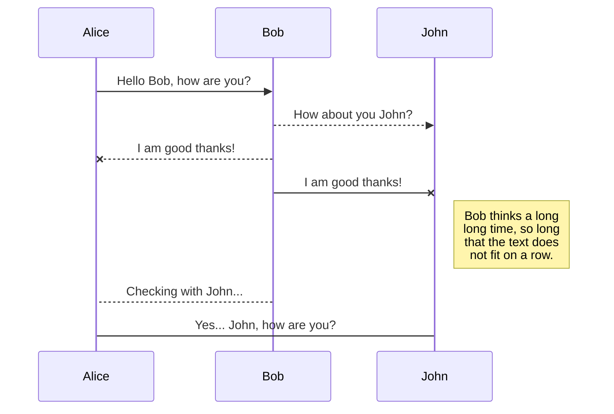
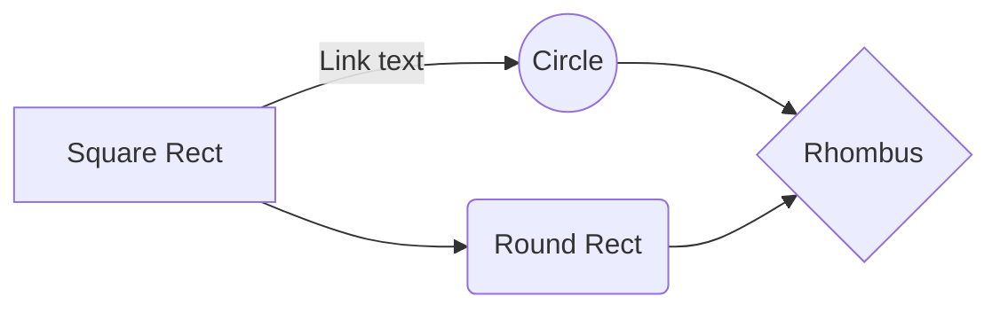

# Heading 1

Lorem ipsum **Blogger**, **Dropbox**, **Gist**, **GitHub**, **Google Drive**, **WordPress** and **Zendesk**. With [Handlebars templates](http://handlebarsjs.com/), you have full control over what you export.

> Quote test **Publish** sub-menu.

- Markdown: publish the Markdown text on a website that can interpret it (**GitHub** for instance),
- HTML: publish the file converted to HTML via a Handlebars template (on a blog for example).

> **Note:** The **Publish now** button is disabled if your file has not been published yet.

# Code block

```python
print("this is a python code block")
```

```js
console.log("this is a javascript code block");
```

## Tables

|                |ASCII                          |HTML                         |
|----------------|-------------------------------|-----------------------------|
|Single backticks|`'Isn't this fun?'`            |'Isn't this fun?'            |
|Quotes          |`"Isn't this fun?"`            |"Isn't this fun?"            |
|Dashes          |`-- is en-dash, --- is em-dash`|-- is en-dash, --- is em-dash|

## Tables 2

| col | col |
|---|---|
| a | 100 |
| b | 200 |


## KaTeX

inline: $\Gamma(n) = (n-1)!\quad\forall n\in\mathbb N$


multiline:

$$
\Gamma(z) = \int_0^\infty t^{z-1}e^{-t}dt\,.
$$

## UML diagrams (mermaid)



And this will produce a flow chart:


